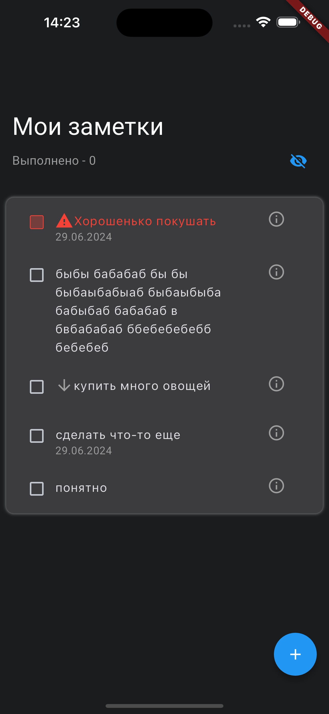
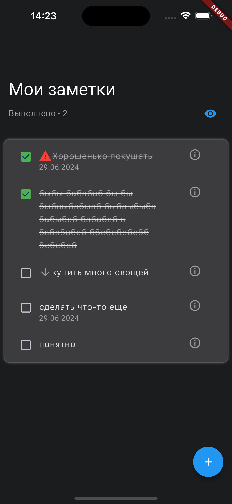
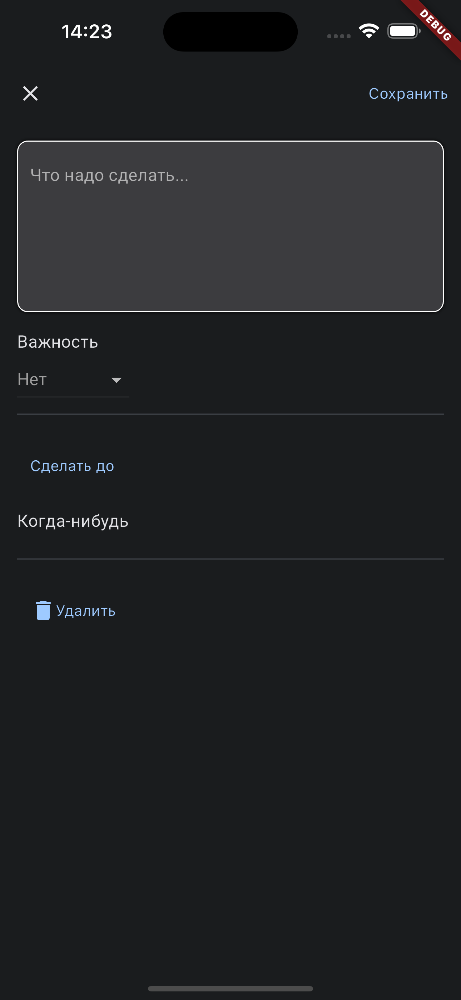

# Simple Notes
Простой проект приложения заметок на Flutter.

## Фичи приложения
<ul>
<li>Список с заметками</li>
<li>Свайп заметок для прочтения/удаления</li>
<li>Добавление новых заметок</li>
<li>Изменение заметок</li>
<li>Хранение данных на бэкенд-сервере</li>
<li>Хранение данных в локальном хранилище</li>
<li>Интернационализация</li>
</ul>




## Как использовать

### Скачать .apk файл из релизов
[Вот тут](https://github.com/aNOOBisTheGod/ada-lovelace/releases) можно найти все релизы приложения, они будут обновляться автоматически, как только будут заливаться изменения в репозиторий

### Клонировать проект и скомпилировать свой Android-релиз
Чтобы клонировать проект, установите Flutter и Git и следуйте этому гайду:
```
git clone https://github.com/aNOOBisTheGod/SimpleNotes.git
cd SimpleNotes
flutter build apk --release 
```

